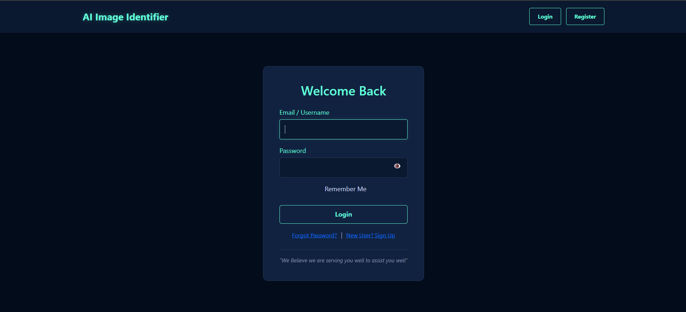
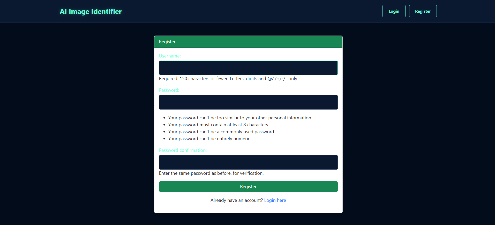
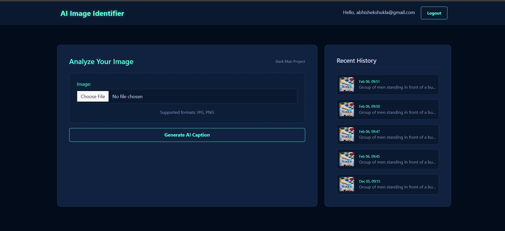
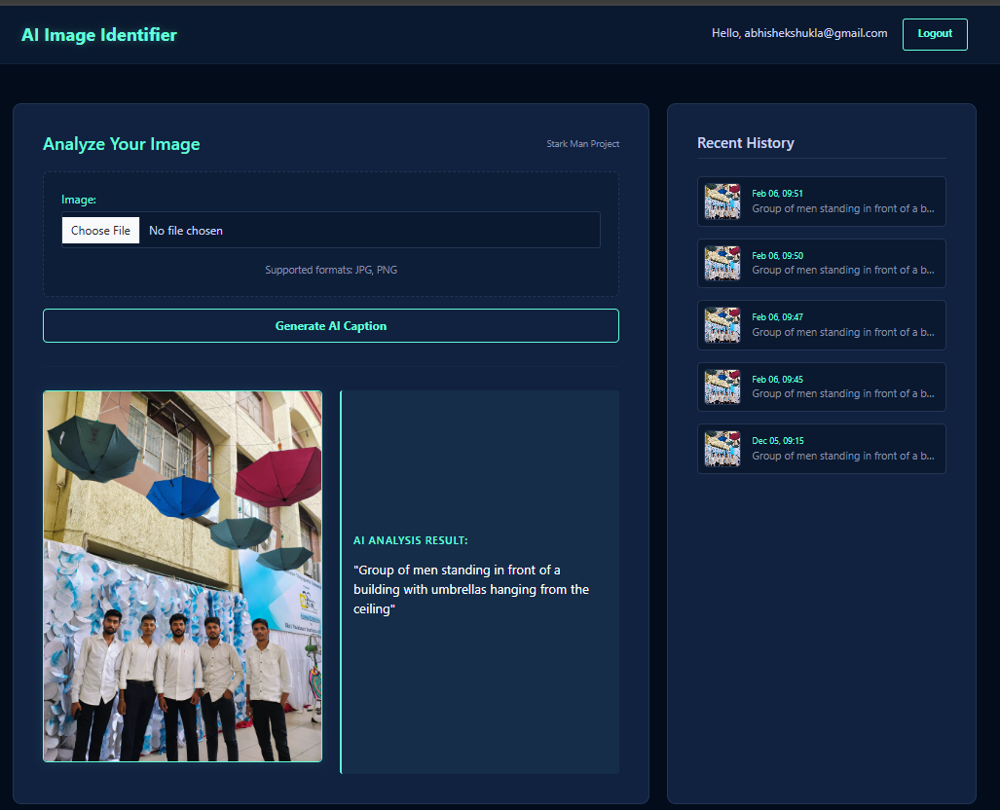

# 🧠 AI Image Identifier

An AI-based image identification web application built using Python and basic Computer Vision techniques.

---

## 🚀 Features
- Image identification using a pre-trained BLIP model
- Generates meaningful captions for uploaded images
- Simple and user-friendly interface
- Supports image upload and processing

---

## 🛠️ Technologies Used
- Python
- Django
- Computer Vision (Basic)
- BLIP Model
- Deep Learning

---

## 📁 Project Files
- ai_project/
- main_app/
- media/
- manage.py
- requirements.txt

---

## ▶️ How to Use
1. Clone the repository
2. Install required dependencies
3. Run the Django development server
4. Upload an image
5. Get AI-generated image description

Commands:
pip install -r requirements.txt
python manage.py runserver

---

## 📦 Repository
https://github.com/AbhishekShukla7655/AI-Image-Identifer

---

## 📸 Screenshots

## 📸 Screenshots

  <figure style="display:inline-block; width:45%; margin:0;">
    
    <figcaption align="center"><b>Login Page</b></figcaption>
  </figure>

  <figure style="display:inline-block; width:45%; margin:0;">
    
    <figcaption align="center"><b>Register Page</b></figcaption>
  </figure>

 

  <figure style="display:inline-block; width:45%; margin:0;">
    
    <figcaption align="center"><b>Home Page</b></figcaption>
  </figure>

  <figure style="display:inline-block; width:45%; margin:0;">
    
    <figcaption align="center"><b>Result Page</b></figcaption>
  </figure>

---

## 👨‍💻 Author
Abhishek Shukla  
https://github.com/AbhishekShukla7655/
